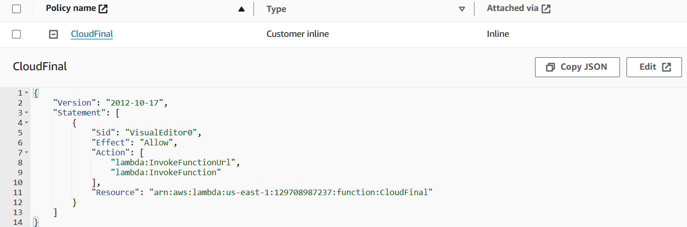

# Cloud Computing Technologies Final Project
## Image Cartoonization

### Software Component and Services
1. [CartoonGAN](https://github.com/Yijunmaverick/CartoonGAN-Test-Pytorch-Torch?tab=readme-ov-file) Machine Learning Model
2. [AWS Lambda](https://aws.amazon.com/th/lambda/)
3. [Amazon SageMaker](https://aws.amazon.com/sagemaker/)
4. [Amazon S3](https://aws.amazon.com/th/s3/)

### Architecture Diagram

### Instructions
#### Amazon SageMaker Setup
1. Download files from this repository to your local computer to initialize the CartoonGAN model
    - `hayao_model.pth`
    - `cartoonify.ipynb`
    - `serve.py`
    - `model.py`
2. Create an IAM role with the following permissions policies in your AWS account
    - [AmazonS3FullAccess](https://docs.aws.amazon.com/aws-managed-policy/latest/reference/AmazonS3FullAccess.html)
    - [AmazonSageMakerFullAccess](https://docs.aws.amazon.com/aws-managed-policy/latest/reference/AmazonSageMakerFullAccess.html)
    - [AWSLambda_FullAccess](https://docs.aws.amazon.com/aws-managed-policy/latest/reference/AWSLambda_FullAccess.html)
3. Create a SageMaker-Notebook instance, associated with the created IAM role from the <b>2nd</b> step
    - ml.t2.medium free tier
    - Amazon Linux 2, Jupyter Lab 3
4. Open the created Jupyter notebook and upload the downloaded files from the <b>1st</b> step
    

    
    

5. Open the `cartoonify.ipynb` and run all cells
6. Wait until the notebook runs successfully and check if a SageMaker endpoint is deployed
    

    
    

#### AWS Lambda Setup
1. Download `lambda_function.py` file from this repository to your local computer
2. Create an IAM role with the following permissions policies
    - [AmazonSageMakerFullAccess](https://docs.aws.amazon.com/aws-managed-policy/latest/reference/AmazonSageMakerFullAccess.html)
3. Create a Lambda function with the source code in the `lambda_function.py` using the created IAM role from the 2nd step
    - Runtime: Python 3.10
	- Architecture: x86_64
    - No trigger and destination
4. Configure an environment variable with the following details
	- Key: ENDPOINT
	- Value: `The name of the created SageMaker endpoint`
    

    
    

5. Set the timeout to two minutes
6. Configure Function URL of the created Lambda function
	- Auth type: AWS_IAM
	- Invoke mode: Buffered (default)
	- Enabled Configure cross-origin resource sharing (CORS)
	- Allow origin: *
	- Allow methods: POST
7. Create an IAM user with the `lambda:InvokeFunctionUrl` and `lambda:InvokeFunction` permissions policies associated with the created Lambda function
    

    
    

8. Create an access key
9. Invoke the Lambda function by using the obtained Function URL and access key from the <b>5th</b> and <b>7th</b> steps